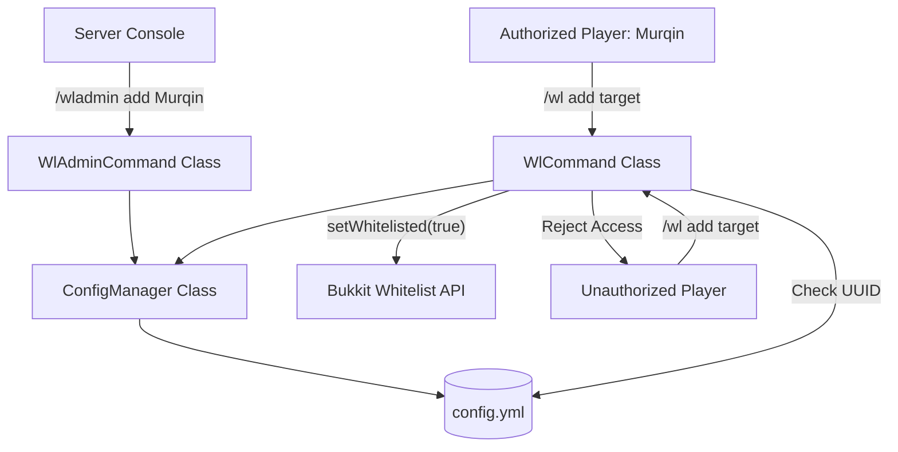

# Whitelist Manager Plugin Design

A custom, lightweight, and highly secure Minecraft plugin designed for Paper/Purpur servers. It enables server administrators to delegate `/whitelist add` and `/whitelist remove` permissions to specific players exclusively through the server console, preventing unauthorized in-game permission changes even by OPs.

## Core Features

- **Console-Only Admin Command (`/wladmin`)**: Permission assignment can ONLY be done from the server console. Any in-game attempts, even by OPs, are rejected.
- **Custom Player Command (`/wl <add|remove>`)**: Authorized players can easily add or remove players from the server whitelist.
- **UUID-based Security**: Authorized players are saved in `config.yml` by both their username and UUID. This ensures security against player username changes.
- **Lightweight & Standalone**: No external dependencies like LuckPerms are required.

---

## 1. System Architecture



---

## 2. File & Component Specification

### 2.1 `pom.xml`
Defines the Maven dependencies, targeting Java 25 and the latest Paper-API.

### 2.2 `plugin.yml`
Registers the plugin, its commands (`wl`, `wladmin`), and registers them cleanly.

### 2.3 `WhitelistManager.java` (Main Class)
Initializes the plugin, registers command executors, and manages instances of managers.

### 2.4 `ConfigManager.java`
Handles:
- Loading the configuration file (`config.yml`).
- Adding/removing authorized players (storing `name` and `uuid`).
- Verifying whether a player's UUID is in the allowed list.
- Reloading the configuration.

### 2.5 `WlAdminCommand.java`
Handles the console command `/wladmin <add|remove|list|reload>`.
- **Constraint**: Must enforce `sender instanceof ConsoleCommandSender`. If false, returns an error: `§c[WL-Admin] This command can only be executed from the server console!`

### 2.6 `WlCommand.java`
Handles the player command `/wl <add|remove> <player>`.
- **Constraint**: Checks if `sender` is a player and their UUID exists in the configuration's authorized list. If not, returns: `§cYou do not have permission to execute this command!`

---

## 3. Data Schema (`config.yml`)

```yaml
# Whitelist Manager Configuration
# Allowed players list. Recommended to manage via console using /wladmin

allowed-players:
  - name: "Murqin"
    uuid: "f8c3de3d-xxxx-xxxx-xxxx-xxxxxxxxxxxx"
```

---

## 4. Verification Plan

### Manual Verification
1. Run the server locally.
2. Attempt to run `/wladmin add Murqin` from the in-game chat (even as OP). Verify it fails with: `This command can only be executed from the server console!`
3. Run `/wladmin add Murqin` from the console. Verify it succeeds and records the UUID in `config.yml`.
4. Log in as `Murqin` and execute `/wl add TestPlayer`. Verify `TestPlayer` is added to the server's whitelist and Bukkit Whitelist system.
5. Log in as another player and try `/wl add TestPlayer`. Verify it fails with `You do not have permission to execute this command!`.
6. Run `/wladmin remove Murqin` from the console. Verify `Murqin` is removed from `config.yml` and can no longer execute `/wl` commands.
