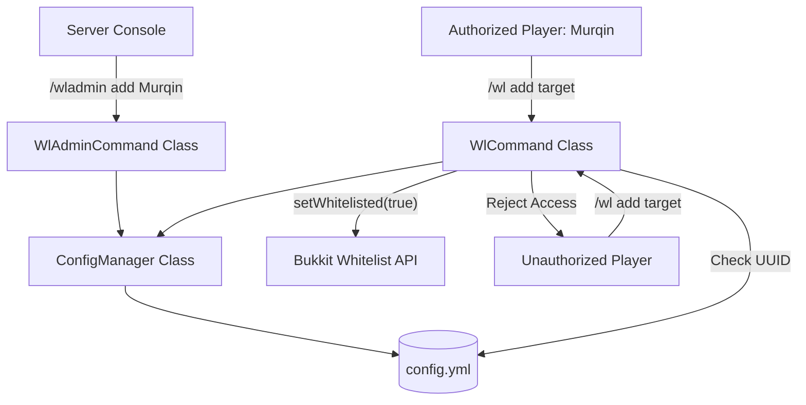

# Whitelist Manager Plugin Design

A custom, lightweight, and highly secure Minecraft plugin designed for Paper/Purpur servers. It enables server administrators to delegate `/whitelist add` and `/whitelist remove` permissions to specific players exclusively through the server console, preventing unauthorized in-game permission changes even by OPs.

## Core Features

- **Console-Only Admin Command (`/wladmin`)**: Permission assignment can ONLY be done from the server console. Any in-game attempts, even by OPs, are rejected.
- **Custom Player Command (`/wl <add|remove>`)**: Authorized players can easily add or remove players from the server whitelist.
- **UUID-based Security**: Authorized players are saved in `config.yml` by both their username and UUID. This ensures security against player username changes.
- **Lockout & Mutiny Protection**: Managers cannot remove themselves or other registered Whitelist Managers from the server's whitelist, avoiding administrative lockouts and sabotage.
- **Instant Kyori Adventure Kick**: Removing a player instantly disconnects them from the server using the modern Paper Kyori Adventure API with customizable kick messages.
- **Automated Name Syncing**: Configured Whitelist Managers are tracked by their Mojang UUID, and their recorded usernames in `config.yml` are automatically updated upon name change during administrative commands.
- **Customizable Multi-Language Messages**: All system feedback, error messages, and kick reasons are fully customizable in `config.yml`, supporting Minecraft color codes (`&` or `§`).
- **bStats Telemetry**: Safely integrates anonymous telemetry to track active installations and platform metrics.
- **Lightweight & Standalone**: No external dependencies like LuckPerms are required.

---

## 1. System Architecture



---

## 2. File & Component Specification

### 2.1 `pom.xml`
Defines the Maven dependencies, targeting Java 25 and the latest Paper-API. Packages and relocates `bStats` safely via `maven-shade-plugin`.

### 2.2 `plugin.yml`
Registers the plugin, its commands (`wl`, `wladmin`), api-version, and registers them cleanly.

### 2.3 `WhitelistManager.java` (Main Class)
Initializes the plugin, registers command executors and tab completers, and registers `bStats` metrics telemetry.

### 2.4 `ConfigManager.java`
Handles:
- Loading the configuration file (`config.yml`).
- Adding/removing authorized players (storing `name` and `uuid`), and auto-updating stored usernames if they change.
- Verifying whether a player's UUID is in the allowed list.
- Fetching color-translated, customizable messages from `config.yml`.
- Reloading the configuration dynamically.

### 2.5 `WlAdminCommand.java`
Handles the console command `/wladmin <add|remove|list|reload>`.
- **Constraint**: Must enforce `sender instanceof ConsoleCommandSender`. If false, returns an error: `§c[WL-Admin] This command can only be executed from the server console!`

### 2.6 `WlCommand.java`
Handles the player command `/wl <add|remove> <player>`.
- **Constraint**: Checks if `sender` is a player and their UUID exists in the configuration's authorized list. If not, returns `no-permission` error.
- **Self-Removal Protection**: Prevents a Whitelist Manager from removing themselves from the whitelist (`self-removal-denied`).
- **Mutiny Protection**: Prevents a Whitelist Manager from removing another registered manager from the whitelist (`admin-removal-denied`).
- **Immediate Disconnection**: Kicks the removed player instantly using Paper's Adventure API and the customizable `kick-reason` message.
- **Tab Completion**: Intelligently filters tab completions, suggesting only currently whitelisted players for `/wl remove`.

---

## 3. Data Schema (`config.yml`)

```yaml
# 1. Allowed Whitelist Managers
allowed-players:
  - name: "Murqin"
    uuid: "f8c3de3d-xxxx-xxxx-xxxx-xxxxxxxxxxxx"

# 2. Localized Messages & Language Settings
messages:
  no-permission: "&cYou do not have permission to execute this command!"
  console-only: "&c[WL-Admin] This command can only be executed from the server console!"
  self-removal-denied: "&cYou cannot remove yourself from the whitelist!"
  admin-removal-denied: "&cYou cannot remove another Whitelist Manager from the whitelist!"
  admin-added: "&a[WL-Admin] %player% (%uuid%) has been promoted to Whitelist Manager."
  admin-already-exists: "&e[WL-Admin] This player is already a Whitelist Manager."
  admin-removed: "&a[WL-Admin] %player%'s Whitelist Manager privileges have been revoked."
  admin-not-found: "&c[WL-Admin] No Whitelist Manager found with the name %player%."
  config-reloaded: "&a[WL-Admin] Configuration file has been successfully reloaded."
  whitelist-already-added: "&e%player% is already whitelisted."
  whitelist-added: "&a%player% has been successfully added to the whitelist."
  whitelist-already-removed: "&e%player% is not whitelisted."
  whitelist-removed: "&a%player% has been successfully removed from the whitelist."
  kick-reason: "&cYou have been removed from the whitelist!"
```

---

## 4. Verification Plan

### Manual Verification
1. Run the server locally.
2. Attempt to run `/wladmin add Murqin` from the in-game chat (even as OP). Verify it fails with: `This command can only be executed from the server console!`
3. Run `/wladmin add Murqin` from the console. Verify it succeeds and records the UUID in `config.yml`.
4. Log in as `Murqin` and execute `/wl add TestPlayer`. Verify `TestPlayer` is added to the server's whitelist and Bukkit Whitelist system.
5. Log in as another player and try `/wl add TestPlayer`. Verify it fails with `You do not have permission to execute this command!`.
6. Run `/wladmin remove Murqin` from the console. Verify `Murqin` is removed from `config.yml` and can no longer execute `/wl` commands.
